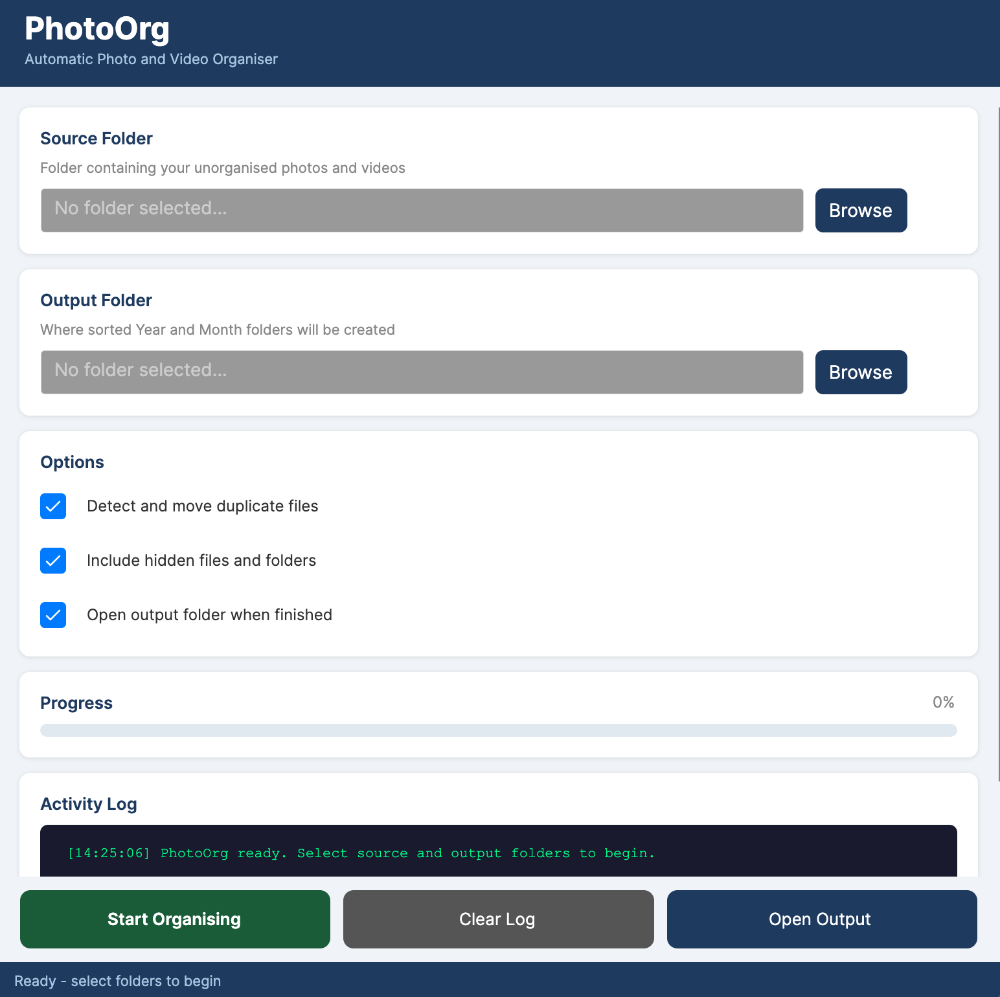

<div align="center">

# PhotoOrg

**Automatically organise thousands of photos and videos into clean Year/Month folders**


[Download Latest Release](https://github.com/anupnairr/PhotoOrg/releases/latest) · [Report a Bug](https://github.com/anupnairr/PhotoOrg/issues) · [Request a Feature](https://github.com/anupnairr/PhotoOrg/issues)



</div>

---

## What it does

PhotoOrg scans a folder of unorganised photos and videos and automatically sorts them into a clean structure based on the date each photo was taken.

**Before:**
```
Photos/
├── IMG_4521.jpg
├── VID_20190823.mp4
├── WhatsApp Image 2022.jpg
├── Screenshot_2021.png
└── holiday.mov
```

**After:**
```
Sorted/
├── 2019/
│   └── 08-Aug/
├── 2021/
│   └── 03-Mar/
├── 2022/
│   └── 06-Jun/
└── Duplicates_Review/
```

---

## Features

- Reads **EXIF metadata** for accurate date detection
- Supports **JPG, HEIC, PNG, GIF, MP4, MOV, MPG, VOB** and more
- **Detects duplicate files** using MD5 hashing
- Duplicates moved to review folder — **nothing is ever deleted automatically**
- Handles **hidden files** automatically
- Clean **Year / Month** folder structure
- Live **progress bar** and activity log
- Works on **Windows 10 and Windows 11**
- Single EXE — **no installation required**

---

## Download and install

1. Go to [Releases](https://github.com/anupnairr/PhotoOrg/releases/latest)
2. Download `PhotoOrg.exe`
3. Double click to run — no installation needed

**Requirements:** Windows 10 or Windows 11

---

## How to use

1. Click **Browse** next to Source Folder and select the folder with your photos
2. Click **Browse** next to Output Folder and choose where to save the organised files
3. Choose your options — duplicate detection is on by default
4. Click **Start Organising**
5. When finished click **Open Output** to see your sorted folders

---

## Supported file types

| Photos | Videos |
|--------|--------|
| JPG, JPEG | MP4, MOV |
| HEIC, HEIF | AVI, MKV |
| PNG, GIF | MPG, MPEG |
| BMP, TIFF | VOB, M4V |
| WEBP, RAW | 3GP, FLV |

---

## Building from source

Requirements: .NET 10 SDK, Git

```bash
git clone https://github.com/anupnairr/PhotoOrg.git
cd PhotoOrg/gui/PhotoOrgApp
dotnet run
```

---

## Contributing

Contributions are welcome. Please read [CONTRIBUTING.md](CONTRIBUTING.md) before submitting a pull request.

---

## License

MIT License — free for personal and commercial use. See [LICENSE](LICENSE) for details.

---

<div align="center">
Made by <a href="https://github.com/anupnairr">Anup Nair</a>
</div>
